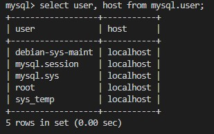
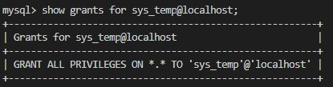
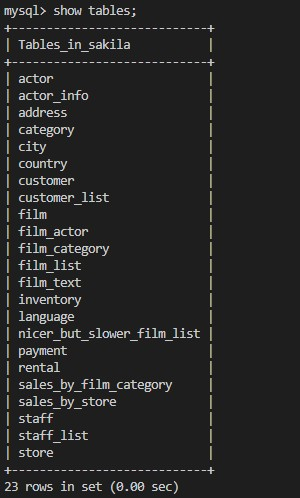
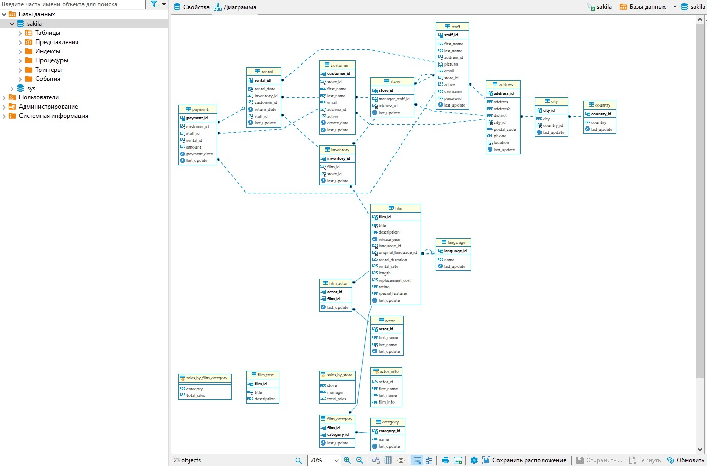
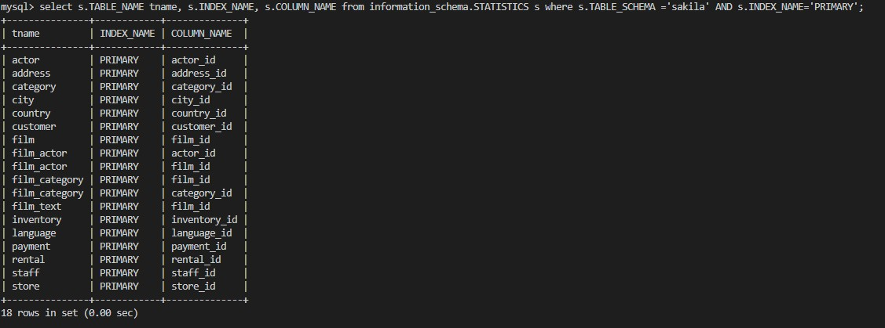
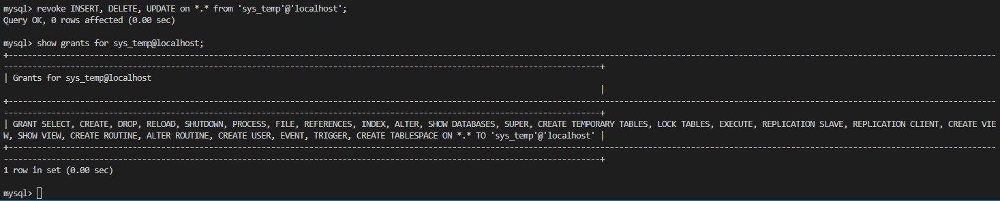

# Домашнее задание к занятию 12.2 "Работа с данными (DDL/DML)" - "Лабазов Александр"

---

Задание можно выполнить как в любом IDE, так и в командной строке.

### Задание 1.
1.1 Поднимите чистый инстанс MySQL версии 8.0+. Можно использовать локальный сервер или контейнер Docker.
1.2 Создайте учетную запись sys_temp. 
1.3 Выполните запрос на получение списка пользователей в Базе Данных. (скриншот)
```sql
select user, host from mysql.user;
```


1.4 Дайте все права для пользователя sys_temp. 
1.5 Выполните запрос на получение списка прав для пользователя sys_temp. (скриншот)
```sql
show grants for sys_temp@localhost;
```


1.6 Переподключитесь к базе данных от имени sys_temp.
Для смены типа аутентификации с sha2 используйте запрос: 
```sql
ALTER USER 'sys_temp'@'localhost' IDENTIFIED WITH mysql_native_password BY 'password';
```
было лень изменять пароль, так и оставил 'password'
1.6 По ссылке https://downloads.mysql.com/docs/sakila-db.zip скачайте дамп базы данных.

1.7 Восстановите дамп в базу данных.
```
unzip sakila-db.zip
cd sakila-db
mysql -usys_temp -p sakilla < ./sakila-schema.sql
mysql -usys_temp -p sakilla < ./sakila-data.sql
```


1.8 При работе в IDE сформируйте ER-диаграмму получившейся базы данных. При работе в командной строке используйте команду для получения всех таблиц базы данных. (скриншот)


*Результатом работы должны быть скриншоты обозначенных заданий, а так же "простыня" со всеми запросами.*

Простыни не вышло, делал через терминал. Хотя не уверен, что сделал всёё правильно. Впрочем, конечный результат, кажется, нормальным.

### Задание 2.
Составьте таблицу, используя любой текстовый редактор или Excel, в которой должно быть два столбца, в первом должны быть названия таблиц восстановленной базы, 
во втором названия первичных ключей этих таблиц. Пример: (скриншот / текст)
```
Название таблицы | Название первичного ключа
customer         | customer_id
```

Запрос:
```sql
select s.TABLE_NAME tname, s.INDEX_NAME, s.COLUMN_NAME from information_schema.STATISTICS s where s.TABLE_SCHEMA ='sakila' AND s.INDEX_NAME='PRIMARY';
```


## Дополнительные задания (со звездочкой*)
Эти задания дополнительные (не обязательные к выполнению) и никак не повлияют на получение вами зачета по этому домашнему заданию. Вы можете их выполнить, если хотите глубже и/или шире разобраться в материале.

### Задание 3.*
3.1 Уберите у пользователя sys_temp права на внесение, изменение и удаление данных из базы sakila.
3.2 Выполните запрос на получение списка прав для пользователя sys_temp. (скриншот)
```sql
revoke INSERT, DELETE, UPDATE on *.* from 'sys_temp'@'localhost';
show grants for sys_temp@localhost;
```

*Результатом работы должны быть скриншоты обозначенных заданий, а так же "простыня" со всеми запросами.*
